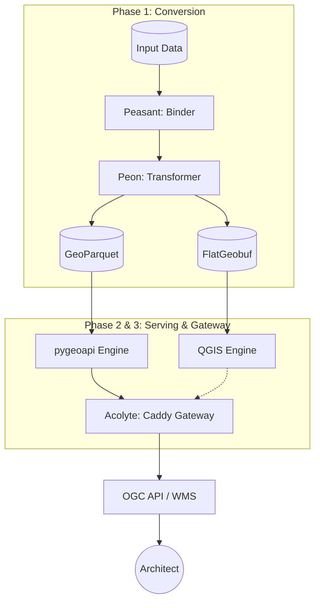

<div align="center">
<h1>Waystones</h1>

**Design, publish, and scale your spatial data infrastructure. Your stack, your rules.**

[](https://react.dev)
[](https://www.typescriptlang.org)
[](https://vitejs.dev)
[](https://supabase.com)
</div>

---

Waystones is a modern, web-native platform that bridges the gap between raw spatial data and production-ready geospatial infrastructure. Built on a high-performance **Snapshot Architecture**, it translates complex data models into standards-compliant OGC API – Features and WMS services in minutes.


## ✨ Key Features

### 🚀 Quick Publish
**From data to live URL in under 60 seconds.**
Drop any GeoPackage into Waystones. We'll auto-infer your schema, generate a beautiful OGC API endpoint, and set up a complete CI/CD pipeline to GitHub. No configuration files, no CLI, just results.

### 🎨 Visual Data Modeler
**Production-ready modeling without the complexity.**
Build complex geospatial schemas with ease:
- **Inheritance & Reusability**: Link layers via inheritance to share field definitions and constraints.
- **Shared Types**: Define custom field types once and reuse them across your entire project.
- **Real-time Validation**: Interactive feedback ensures your model is always standards-compliant before you deploy.
- **Dynamic Styling**: Built-in Layer Style Editor for consistent cartography across WMS and OGC API services.

### 🍱 Portable Cloud Deployment
**Production-ready infrastructure as code.**
Deploy your services to your favorite cloud with pre-configured, self-contained kits:
- **Cloud Native**: Support for **Railway** and **Docker** environments.
- **Modern Standards**: Automatically generates `pygeoapi` (REST) and **QGIS Server** (WMS) configurations.
- **Self-Contained**: Deployment kits include all necessary Dockerfiles and boot scripts for one-click deployment.
- **Live Data Sync**: Integrated **Delta Sync Engine** (The Shade) for keeping live PostGIS and Supabase sources in sync.
- **Advanced Metadata**: Built-in support for **STAC** (SpatioTemporal Asset Catalog) catalogs.

### 🔍 GitHub-First Workflow
**Version control is in our DNA.**
- **Interactive Review**: Compare changes visually with integrated Git diffs before pushing.
- **OAuth Integration**: Securely browse and manage your repositories directly from the UI.
- **PR Workflows**: Push directly to branches or create Pull Requests for collaborative review.

### 🤖 AI-Powered Assistant
**Let AI do the heavy lifting.**
Connect Claude or Gemini to auto-generate metadata, field descriptions, and even infer constraints from your sample data.

---

## 🛠 Tech Stack

| Layer | Technology |
|---|---|
| **Frontend** | React 19, TypeScript, Vite 6 |
| **Geospatial** | GDAL3.js, jszip, js-yaml, STAC |
| **Icons** | Lucide React |
| **Sources** | PostGIS (pg), Supabase, GeoPackage |
| **Engines** | pygeoapi, QGIS Server |
| **Deployment** | Docker, Railway, GitHub Actions |

## 🚀 Getting Started

Waystones is designed for Node.js 22+.

```bash
# Install dependencies
npm install

# Start the development server
npm run dev
```

Visit `http://localhost:3000` and start modeling.

### ⚙️ Environment Variables

For full functionality, copy `.env.example` to `.env` (if it exists) or manually configure:

```env
# GitHub OAuth (required for GitHub integration)
GITHUB_CLIENT_ID=your_github_oauth_app_id
GITHUB_CLIENT_SECRET=your_github_oauth_app_secret
VITE_GITHUB_REDIRECT_URI=http://localhost:3000/auth/callback

# Optional: AI Assistant (Claude or Gemini)
VITE_DEFAULT_AI_KEY=your_api_key_here
VITE_DEFAULT_AI_PROVIDER=claude  # or 'gemini'
```

The app includes a small Express server (`server.js`) that proxies GitHub OAuth and handles PostGIS schema imports. In development, `npm run dev` starts both Vite and the server automatically.

---

## 🏗 Snapshot Architecture

Waystones projects are powered by a high-performance **Snapshot Architecture**. Instead of connecting directly to slow databases or GeoPackages at runtime, a fleet of **Working Units** collaborate to convert and serve data in optimized cloud-native formats.



### 👷 The Working Units

| Unit | Role | Lore |
|---|---|---|
| **Peon** | **GIS Engine** | The heavy-lifter. Handles raw GDAL/OGR transformations and snapshots. |
| **Peasant** | **Data Binder** | The coordinator. Fetches data from sources and binds it for the Peon. |
| **Acolyte** | **Gateway Portal** | The protector. A Caddy-based sidecar that orchestrates traffic and ensures health. |
| **Shade** | **STAC Chronicler** | The observer. Manages the STAC catalog and incremental delta exports. |

### 🚀 Key Components
- **OGC API – Features**: RESTful access to your data via **pygeoapi** serving **GeoParquet**.
- **WMS**: Lightning-fast map rendering via **QGIS Server** serving **FlatGeobuf**.
- **CI/CD**: GitHub Actions workflows for automated builds and cloud pushes.
- **Automated Warming**: Background pre-warming of DuckDB collections for instant cold boots.
- **Instant Boot**: Non-blocking OpenAPI generation for immediate service availability.

### 🐳 Docker Configuration
The Waystones Docker images support advanced configuration via environment variables:

| Variable | Default | Description |
|---|---|---|
| `PORT` | `5000` | The public port for the service. |
| `DEPLOY_PYGEOAPI` | `1` | Set to `0` to run in Gateway-only mode (Caddy only). |
| `DEPLOY_SIDE_GATEWAY` | `0` | Set to `1` to enable the Caddy sidecar (proxies to pygeoapi on 5001). |
| `CONTAINER_WORKERS` | `2` | Number of Gunicorn worker processes. |
| `WARMUP_DELAY` | `15` | Seconds to wait before background GeoParquet warming. |

## 🌍 Supported Standards
- **OGC API – Features** (Full Part 1 & 2 support)
- **WMS** — Web Map Service
- **GeoPackage, GeoJSON, GML, Shapefile**
- **STAC** — SpatioTemporal Asset Catalog

## 🎮 Live Demos

Experience Waystones in action with these live service endpoints:

- **OGC API - Features**: [oapi-waystones.up.railway.app](https://oapi-waystones.up.railway.app/)
- **WMS (Web Map Service)**: [GetCapabilities](https://wms-waystones.up.railway.app/ows/?SERVICE=WMS&REQUEST=GetCapabilities)


## 📁 Project Structure

```
waystones/
├── components/        # React UI components (dialogs, editor, deploy panels, etc.)
├── hooks/             # Custom React hooks (useLayerActions, useHistory, etc.)
├── utils/             # Services and utilities
│   ├── deploy/        # Deployment generators (pygeoapi, QGIS, Docker, GitHub Actions)
│   ├── gdalService    # GeoPackage and raster processing
│   ├── aiService      # AI assistant integration (Claude & Gemini)
│   ├── githubService  # GitHub API integration
│   └── ...
├── api/               # Backend endpoints
│   └── github-oauth.js  # GitHub OAuth proxy
├── server.js          # Express backend server
├── App.tsx            # Root React component
└── types.ts           # TypeScript type definitions
```

## 🇳🇴 Language Support
Full UI translations for **English** and **Norwegian**.

## 🤝 Contributing

Contributions are welcome! To ensure clear ownership, all contributors must agree to our **Contributor License Agreement (CLA)**.

1. **Sign the CLA**: Please read our [CLA](CLA.md) before submitting a pull request.
2. [Open an issue](../../issues) to discuss significant changes first.
2. Follow the existing code style and patterns.
3. Test your changes locally with `npm run dev` and `npm run lint`.

---

## ⚖️ License
Waystones is licensed under the **GNU Affero General Public License v3.0 (AGPL-3.0)**. 

Contributions are subject to our [Contributor License Agreement (CLA)](CLA.md).
